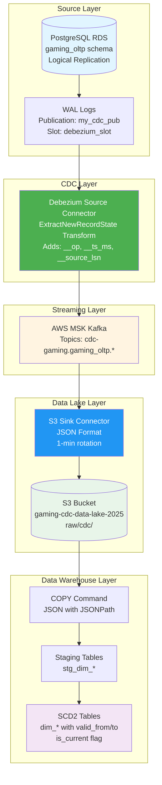

# CDC SCD Type 2 Pipeline - Architecture Diagram

## Architecture Overview



---

## Data Flow

```
┌─────────────┐    WAL     ┌─────────────┐   JSON    ┌─────────┐   JSON   ┌─────────┐   COPY   ┌──────────┐
│ PostgreSQL  │ ───────── │  Debezium   │ ──────── │  MSK    │ ─────── │   S3    │ ─────── │ Redshift │
│  RDS        │           │  Connector  │          │  Kafka  │         │  Bucket │         │ Serverless│
│             │           │             │          │         │         │         │         │          │
│ gaming_oltp │           │ Flatten +   │          │ Topics  │         │ JSON    │         │ SCD2     │
│ schema      │           │ CDC fields  │          │         │         │ Files   │         │ Tables   │
└─────────────┘           └─────────────┘          └─────────┘         └─────────┘         └──────────┘
     Source                   CDC                    Streaming           Storage             Analytics
```

**Latency:** Source → Kafka: <1s | Kafka → S3: <1min | S3 → Redshift: On-demand

---

## Component Configuration

### PostgreSQL RDS (Source)
| Setting | Value |
|---------|-------|
| Schema | `gaming_oltp` |
| Publication | `my_cdc_pub` |
| Replication Slot | `debezium_slot` |
| Plugin | `pgoutput` |

**Tables:** `dim_user`, `dim_game`, `dim_session`, `fact_game_event`

### Debezium Source Connector
| Setting | Value |
|---------|-------|
| Connector Class | `PostgresConnector` |
| Topic Prefix | `cdc-gaming` |
| Transform | `ExtractNewRecordState` |
| Added Fields | `__op`, `__ts_ms`, `__source_ts_ms`, `__source_lsn` |
| Delete Handling | `rewrite` (tombstones preserved) |

### S3 Sink Connector
| Setting | Value |
|---------|-------|
| Format | JSON |
| Topics Directory | `raw/cdc` |
| Flush Size | 100 records |
| Rotate Interval | 60000 ms (1 min) |
| Bucket | `gaming-cdc-data-lake-2025` |

### Redshift Serverless (Target)
| Setting | Value |
|---------|-------|
| Database | `gaming_dwh` |
| Schema | `bronze` |
| Load Method | COPY with JSONPath mapping |

---

## SCD Type 2 Implementation

### Dimension Tables Structure
```sql
CREATE TABLE bronze.dim_user (
    -- Business attributes
    user_id VARCHAR(36) NOT NULL,
    username VARCHAR(100),
    email VARCHAR(255),
    country VARCHAR(50),
    account_level VARCHAR(20),
    total_playtime_hours DOUBLE PRECISION,
    last_login_at TIMESTAMPTZ,
    
    -- SCD2 columns
    valid_from TIMESTAMPTZ NOT NULL,
    valid_to TIMESTAMPTZ,
    is_current BOOLEAN NOT NULL DEFAULT TRUE,
    
    -- Audit
    event_timestamp TIMESTAMPTZ NOT NULL,
    source_lsn BIGINT
)
DISTKEY(user_id)
SORTKEY(user_id, is_current, valid_from);
```

### SCD2 Merge Logic

| Operation | CDC Flag | Action |
|-----------|----------|--------|
| **Insert** | `__op='c'` or `'r'` | Insert new record with `is_current=TRUE`, `valid_from=__ts_ms` |
| **Update** | `__op='u'` | Close current: `is_current=FALSE`, `valid_to=__ts_ms`<br/>Insert new version |
| **Delete** | `__op='d'` | Close current: `is_current=FALSE`, `valid_to=__ts_ms` |

### Key Merge Steps
1. **Deduplicate** staging by `__source_lsn` (keep latest per business key)
2. **Close** current records when attributes change
3. **Insert** new versions for changed or new records
4. **Handle deletes** by closing current records

---

## Kafka Topics

| Topic | Source Table |
|-------|--------------|
| `cdc-gaming.gaming_oltp.dim_user` | `dim_user` |
| `cdc-gaming.gaming_oltp.dim_game` | `dim_game` |
| `cdc-gaming.gaming_oltp.dim_session` | `dim_session` |
| `cdc-gaming.gaming_oltp.fact_game_event` | `fact_game_event` |

---

## JSONPath Mapping Files

Required for Redshift COPY command:
- `jsonpath-dim-user.json`
- `jsonpath-dim-game.json`
- `jsonpath-dim-session.json`
- `jsonpath-fact-game-event.json`

Upload to: `s3://gaming-cdc-data-lake-2025/jsonpath/`

---

## Query Examples

### Current State
```sql
SELECT user_id, username, account_level, valid_from
FROM bronze.dim_user
WHERE is_current = TRUE;
```

### Point-in-Time Query
```sql
SELECT user_id, username, account_level
FROM bronze.dim_user
WHERE user_id = 'abc-123'
  AND valid_from <= '2025-01-01 00:00:00'
  AND (valid_to > '2025-01-01 00:00:00' OR valid_to IS NULL);
```

### Complete History
```sql
SELECT user_id, account_level, valid_from, valid_to, is_current
FROM bronze.dim_user
WHERE user_id = 'abc-123'
ORDER BY valid_from;
```


